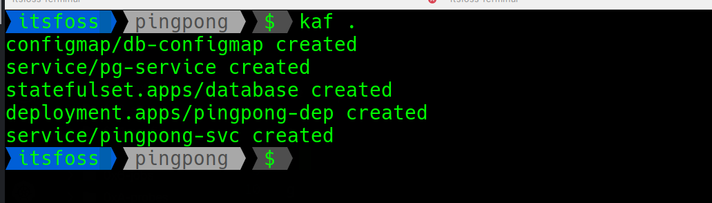
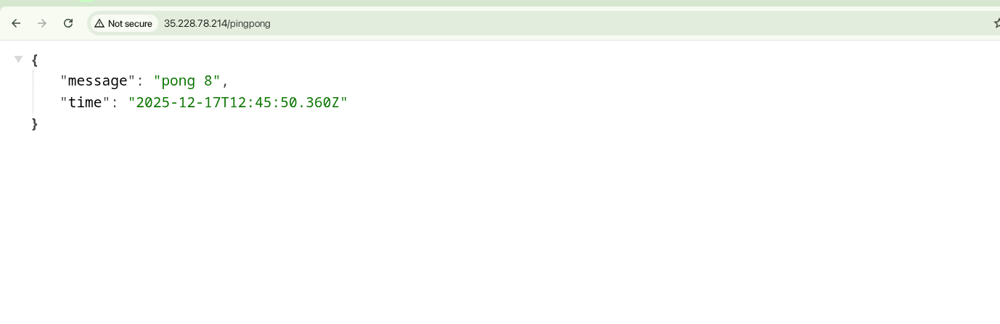
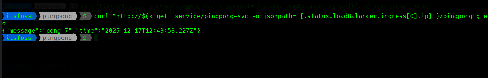

## GKE

Working with the Google Kuberentes Engine

## Steps

1. Setup a GKE Cluster using the gcloud-sdk by running the command.

```
gcloud container clusters create dwk-prod --zone=europe-north1-b --cluster-version=1.32 --disk-size=32 --num-nodes=3 --machine-type=e2-micro
```

Don't hold your breath, it may take a while.

2. Go the the pingpong directory by running

```
cd pingpong
```

3. Apply the manifests and let it happen.

```
kaf .
```



4. Get the External IP address from the `pingpong-svc` service and open it in a browser.



Or you could run this command directly in the terminal and see the response

```bash
curl "http://$(kubectl get service/pingpong-svc -o jsonpath='{.status.loadBalancer.ingress[0].ip}')/pingpong"; echo
```


